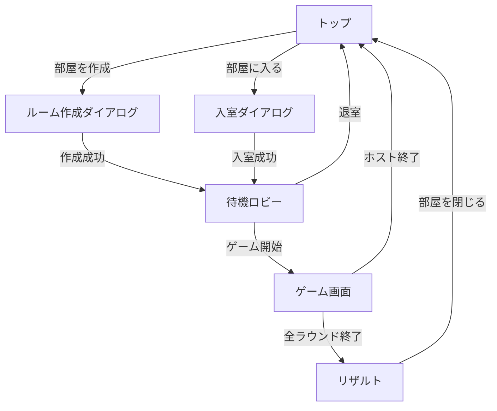

# UI設計

## 1. 目的
MVPの各画面におけるUI要件、表示要素、操作、状態を整理する。

## 2. 画面一覧
- トップ
- ルーム作成ダイアログ
- 入室ダイアログ
- 待機ロビー
- ゲーム画面
- リザルト

## 2.1 画面遷移図

## 3. 画面別要件
### 3.1 トップ
目的: ルーム作成/入室の入口
- 表示要素
  - タイトル/説明文
  - 「部屋を作成」ボタン
  - 「部屋に入る」ボタン
- 操作
  - 作成/入室ボタンで各ダイアログを表示

### 3.2 ルーム作成ダイアログ
目的: ルームの新規作成
- 入力
  - 部屋名（必須 2-24文字）
  - パスワード（必須 4-16文字）
  - ユーザー名（必須 1-16文字）
  - ラウンド数（1-10）
  - 制限時間（1/2/3/4/5分）
- バリデーション
  - 文字数不足/超過
  - 既存名重複（サーバーエラー）
- 操作
  - 「作成」: `create-room` 呼び出し
  - 成功時: 待機ロビーへ遷移（ホスト）

### 3.3 入室ダイアログ
目的: 既存ルームへ参加
- 入力
  - 部屋名
  - パスワード
  - ユーザー名（必須 1-16文字）
- バリデーション
  - パスワード不一致/満員/部屋なし
  - ユーザー名重複
- 操作
  - 「入室」: `join-room` 呼び出し
  - 成功時: 待機ロビーへ遷移

### 3.4 待機ロビー
目的: 参加者の合流と開始
- 表示要素
  - 参加者一覧（ユーザー名、ホスト表示）
  - ルーム設定表示（ラウンド数、制限時間）
  - 現在人数
  - 「ゲーム開始」ボタン（ホストのみ）
  - 「退室」ボタン
- 操作
  - ホストのみ設定変更/開始可能
  - 退室は `room_members` DELETE
- 状態
  - 2名以上で開始推奨

### 3.5 ゲーム画面
目的: 描画/回答/進行
- 表示要素
  - 左: 描画キャンバス
  - 右: タイマー、ラウンド数、スコア一覧、役割表示
  - 下: 回答入力（チャット欄）
  - システムメッセージ領域
- 操作
  - 出題者のみ描画操作（ペン/消しゴム/太さ/Undo/クリア）
  - 回答者は回答入力
  - ホストのみ「ゲーム終了」
- 状態
  - 出題者: お題文字列を表示
  - 回答者: お題の文字数のみ表示
  - 正解/時間切れ後は結果モーダルを5秒表示
  - 異常系: ホストが終了/退室した場合、通知を5秒表示してトップへ戻る

### 3.6 リザルト
目的: スコア表示と終了
- 表示要素
  - 総合順位/スコア（`v_room_scores`）
  - 各ラウンドごとの絵の一覧（ラウンド終了時点の絵）
  - 次のゲーム設定（ホストのみ: ラウンド数/制限時間）
  - 「もう一度遊ぶ」ボタン（将来拡張）
  - 「部屋を閉じる」ボタン（ホストのみ）
- 操作
  - ホストが `end-game` でルーム削除
  - ホストは設定を更新して次ゲームを開始可能

## 4. 共通要件
- Realtime反映: 参加者/ラウンド/回答の変更を即時反映
- エラー表示: 400/403/409 を日本語で表示
- レスポンシブ: モバイル/デスクトップ対応
