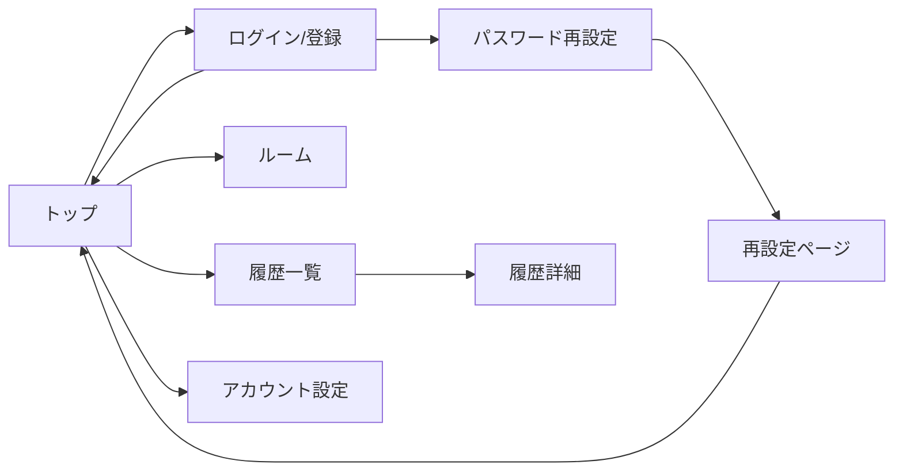

# アカウント・履歴設計

## 1. 目的
ログイン機能と履歴保存機能の設計方針を定義する。

## 2. 認証方式
- Supabase Auth（メール/パスワード、任意ログイン）
- ログイン入力はユーザー名 + パスワード（内部でメール解決）
- パスワード再設定はメール送信
- 認証済み JWT を API に付与

## 3. データ設計（概要）
### 3.1 profiles
- `auth.users` と1:1
- `username` をユニークに管理
- 画面表示名や履歴表示に利用

### 3.2 game_sessions
- 対戦履歴のヘッダ
- いつ/どの部屋/設定で遊んだかを保持

### 3.3 game_participants
- セッションの参加者情報
- 当時の表示名とスコアを保持

### 3.4 round_snapshots
- ラウンド終了時の絵
- Storage のURLとお題/正解者/出題者を保持

## 4. 履歴保存のタイミング
- ログイン済みユーザーがリザルト到達時: `game_sessions` 作成/更新
- 同時に参加者情報を `game_participants` に保存
- ラウンド絵は `round_snapshots` に保存（MVPでは data URL を格納）

## 5. アクセス制御（RLS）
- profiles: 本人のみ参照/更新
- game_sessions: セッション参加者のみ参照
- game_participants: セッション参加者のみ参照
- round_snapshots: セッション参加者のみ参照

## 6. UI方針
- 未ログインでもゲーム可能
- ログイン後は履歴一覧にアクセス可能
- アカウント設定でユーザー名/パスワードを変更可能（トップのユーザーアイコン）
- パスワード再設定は「ユーザー名入力 → メール送信 → 再設定ページ」で実施
- トップの「プレイ履歴」ボタンから履歴一覧へ遷移

## 7. 画面遷移（簡易）

