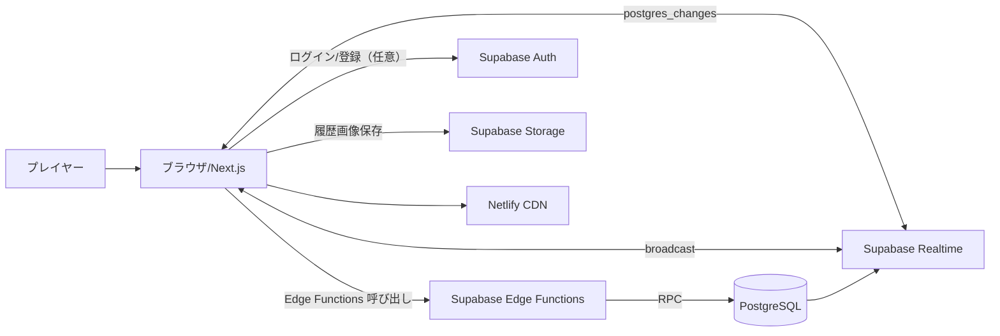

# システムアーキテクチャ

## 目的
オンラインお絵描き当てバトル（MVP）の全体構成を俯瞰し、主要コンポーネント間の責務と通信経路を明確にする。

## 全体構成
- クライアント: Next.js（Netlify 配信）
- バックエンド: Supabase（PostgreSQL, Realtime, Edge Functions, Storage）
- 認証: Supabase Auth（メール/パスワード、任意）

## 主要コンポーネント
- Next.js
  - ルーム作成/入室、ゲーム進行、描画/回答UIを提供
  - Realtime 購読により状態更新を反映
- Supabase Edge Functions
  - ルーム作成/入室/開始/進行/終了の API 入口
  - RPC で DB 制御を一括実行
- PostgreSQL
  - ルーム/参加者/ラウンド/回答/スコアを永続化
  - 履歴/プロフィールを永続化
  - トリガで採点とラウンド進行を保証
- Supabase Realtime
  - `rooms/room_members/rounds/guesses` の変更通知
  - 描画は `room:<room_id>` の broadcast を利用

## 主要データフロー
- ルーム作成/入室
  - フロント → Edge Function → RPC → DB
- ゲーム開始
  - ホスト → `start-game` → ラウンド生成 → `rooms.status = in_progress`
- 回答/採点/進行
  - `guesses` INSERT → トリガで採点 → 初正解で `advance_round`
- 描画同期
  - Realtime チャンネルで stroke 差分を broadcast（非永続）

## セキュリティ
- 認証済み JWT を API に添付
- RLS によりルーム/履歴スコープのデータアクセスを制限
- パスワードは `pgcrypto.crypt` でハッシュ保存

## デプロイ
- フロント: Netlify
- バックエンド: Supabase（DB/Realtime/Functions）
