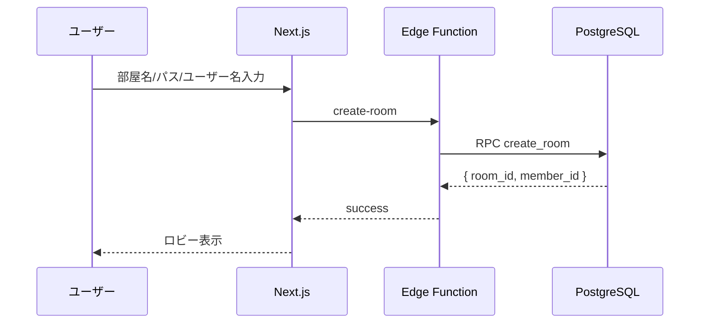
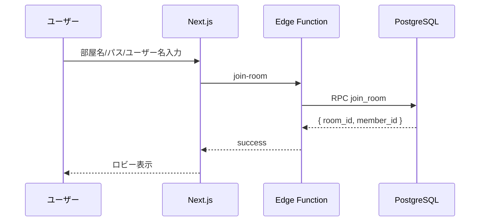
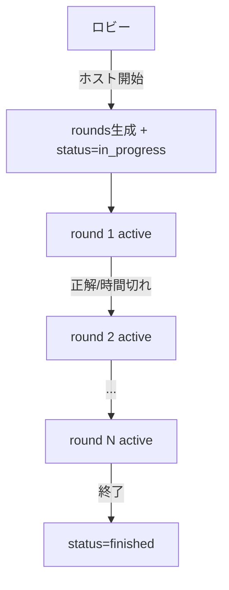
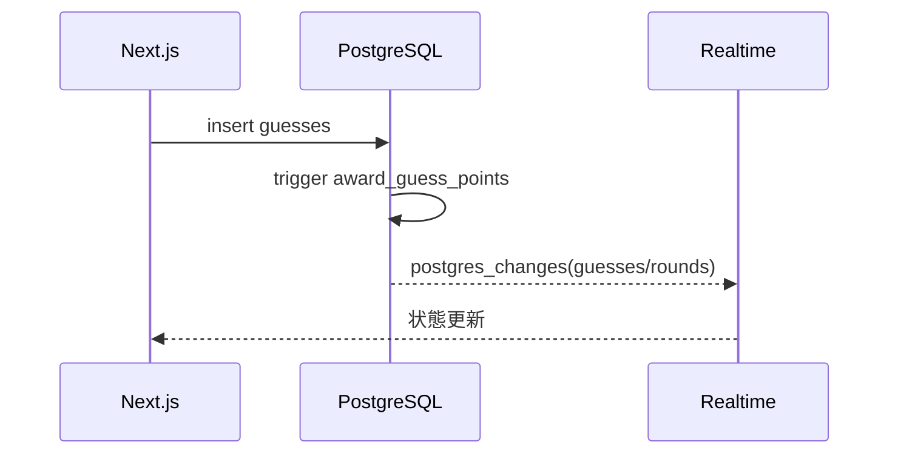

# 基本設計

## 1. 目的
要件定義を満たすMVPの構成要素と主要フローを定義する。

## 2. 画面/機能一覧
- トップ: ルーム作成/入室
- 待機ロビー: 参加者一覧、設定、開始
- ゲーム画面: 描画/回答/タイマー/スコア
- リザルト: スコアボード

## 3. 機能ブロック
- ルーム管理: 作成/入室/退室、ホスト権限
- ゲーム進行: ラウンド生成、開始/進行/終了
- 描画同期: Realtime broadcast
- 回答/採点: `guesses` INSERT とトリガ
- スコア表示: `v_room_scores`

## 4. 主要ユースケース
### 4.1 ルーム作成

### 4.2 入室

### 4.3 ゲーム開始/進行

### 4.4 回答/採点

## 5. データ連携
- Edge Functions → RPC: ルーム/進行系の書き込みを集約
- Realtime: `rooms/room_members/rounds/guesses` を購読
- 描画: `room:<room_id>` で stroke を broadcast

## 6. 主要制約
- 最大人数: 10
- ラウンド数: UI 1〜10（DB 1〜20）
- 制限時間: UI 60〜300秒（DB 30〜300秒）
