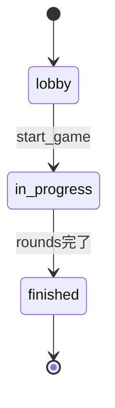
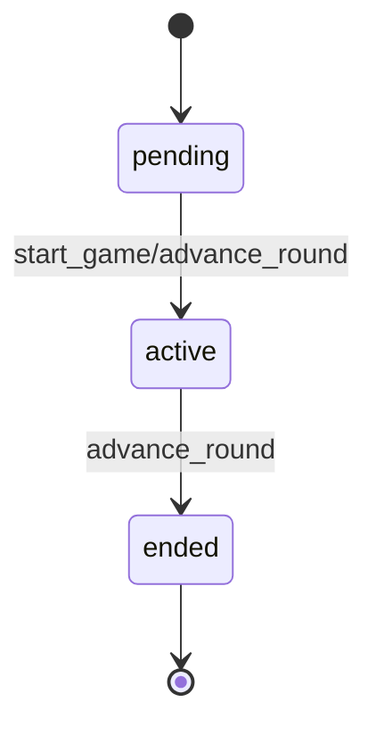
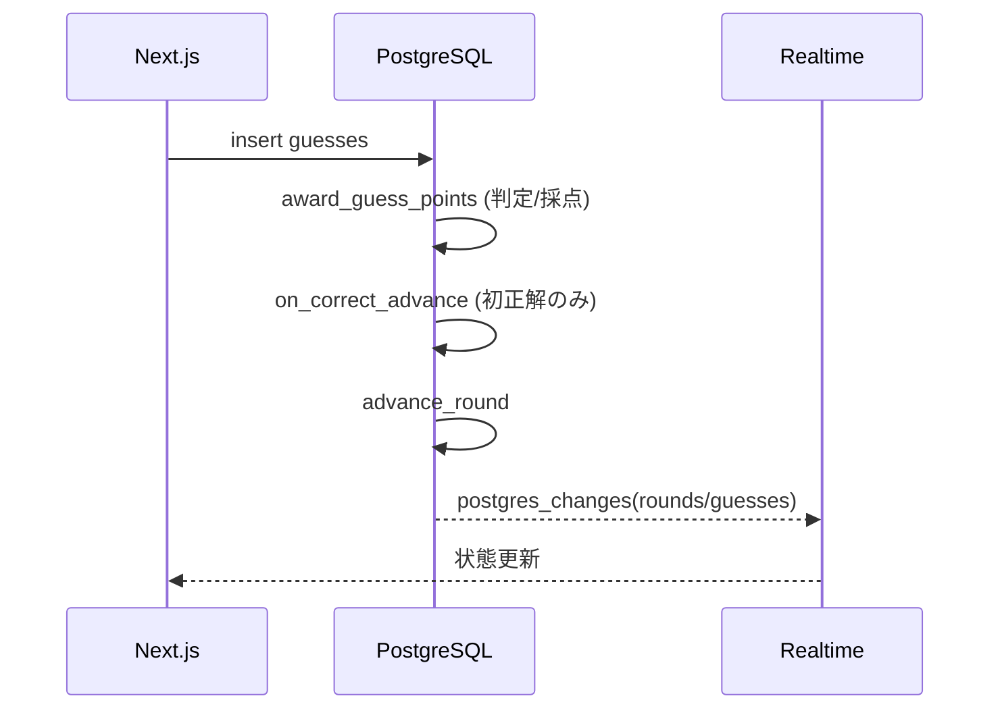
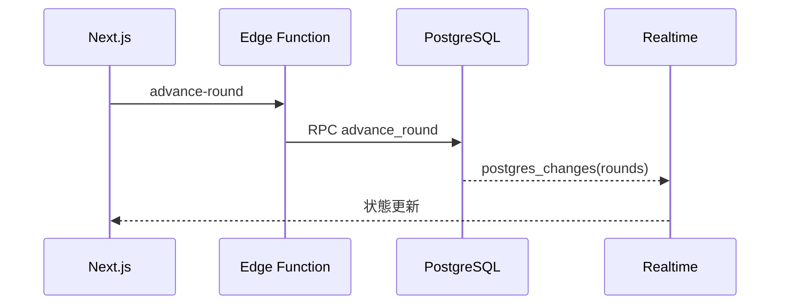

# 詳細設計

## 1. フロントエンド詳細
- `frontend/app/page.tsx`
  - ルーム作成/入室 UI
  - Edge Functions 呼び出し
- `frontend/app/history/page.tsx`
  - プレイ履歴一覧表示
- `frontend/app/reset-password/page.tsx`
  - パスワード再設定ページ（メールリンクから遷移）
- `frontend/app/room/[roomName]/page.tsx`
  - ロビー/ゲーム画面の状態制御
  - Realtime 購読と描画同期
  - リザルト到達時に履歴保存（ログイン時のみ）
- `frontend/components/CanvasBoard.tsx`
  - 描画・消しゴム・太さ・Undo/クリア
  - Realtime broadcast でストローク配信
- `frontend/lib/supabaseClient.ts`
  - Supabase クライアント生成

## 2. バックエンド詳細
### 2.1 Edge Functions
- `create-room` / `join-room` / `start-game` / `advance-round` / `end-game` / `sign-up`
- 認証: `Authorization: Bearer <JWT>`（`sign-up` は不要）
- 主要処理は RPC に委譲

### 2.2 RPC/DB処理
- `create_room` / `join_room` / `start_game` / `advance_round` / `end_game`
- `get_active_prompt` / `get_room_members` / `my_member_id`
- 採点は `award_guess_points` トリガで実施（最初の正解者 +1）

### 2.3 認証/アカウント
- Supabase Auth（メール/パスワード、任意ログイン）
- プロフィールは `profiles` に保持
- ユーザー名ログインは `get_login_email` でメール解決

## 3. 状態遷移
### 3.1 ルーム状態

### 3.2 ラウンド状態

## 4. 正解時の自動進行

## 5. タイムアップ時の進行

## 6. エラーハンドリング
- Edge Functions: 400/403/409 を返却
- UI: 日本語メッセージに変換して表示
- DB: 主要ルールは制約/トリガで担保

## 7. Realtime 仕様
- `postgres_changes`: rooms, room_members, rounds, guesses
- `broadcast`: `room:<room_id>` で描画ストロークを送信

## 9. 履歴保存
- ラウンド終了時にキャンバスを画像化し Storage に保存
- `game_sessions` / `game_participants` / `round_snapshots` に記録
## 8. パフォーマンス/整合性
- 採点はラウンド行ロックで同時正解を直列化
- 描画データは非永続で DB 負荷を最小化
